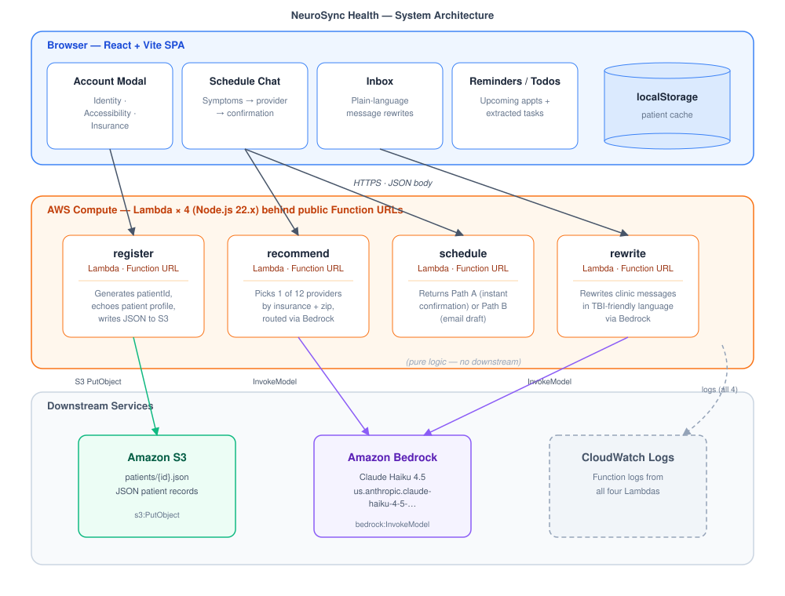
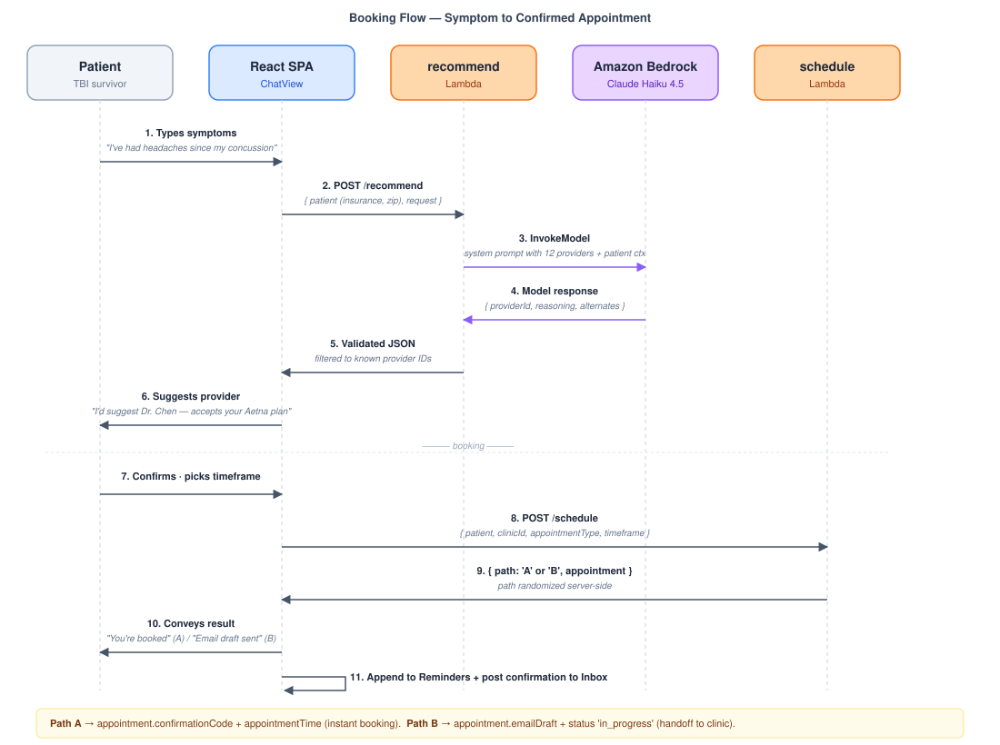

# NeuroSync Health

A TBI-aware healthcare scheduling assistant — a calm, plain-language interface that helps survivors of Traumatic Brain Injury find the right provider, book appointments, and understand clinic messages.

AWS Hacks 2026 @ Seattle University

## Team

- Vikash Vuchhuru
- Zander Rothstein

## Track

Code for Good

## Architecture



The chat, inbox, and onboarding all flow through four standalone Lambdas behind public Function URLs. Two of them call Bedrock (Claude Haiku 4.5) for the AI work; `register` writes to S3; `schedule` is pure logic. The frontend gracefully falls back to local mock data per endpoint when its URL env var is missing.

### Booking flow



## What was built

- Patient onboarding — A 3-step modal captures identity, TBI-aware accessibility preferences , and insurance provider. The record is persisted to `localStorage`  and optionally written to S3 by the `register` Lambda.
- AI-assisted scheduling — A guided chat  captures symptoms in the patient's own words. Amazon Bedrock (Claude Haiku 4.5) picks one of 12 TBI-aware providers across 6 specialties (Neurology, Physical Therapy, Speech-Language Pathology, Occupational Therapy, Mental Health, Primary Care). The patient confirms, picks a timeframe, and books.
- Insurance-aware routing — Each provider is tagged with the insurance plans they accept and a Seattle neighborhood + ZIP. The recommender prefers providers that match the patient's insurance, falls back to the closest provider in the right specialty when no plan fits (and plainly tells the patient to verify coverage), and shows a  "we're working on adding more specialists soon" block when nothing in the registry fits at all.
- Dual-path booking — The `schedule` Lambda returns either an instant confirmation with a confirmation code (Path A) or a TBI-aware email draft sent on the patient's behalf to the clinic (Path B). The path is randomized per call to demonstrate both flows.
- Plain-language inbox — Clinic messages can be rewritten by the `rewrite` Lambda (Bedrock) into short, TBI-friendly sentences with action items preserved and urgency language stripped out.
- Auto-extracted todos — Messages produce checkable to-do items that sit alongside reminders on the home dashboard.
- Per-endpoint mock fallback — The frontend runs without any AWS access. Each `VITE_*_URL` env var toggles its endpoint independently, so any subset of Lambdas can run live while the rest fall back to local mock data that mirrors the real response shapes.

## What was not built

Scope cuts made deliberately to stay within hackathon time:

- No real authentication, accounts, or multi-device sync. Patient state lives in `localStorage`.
- No real insurance eligibility / coverage verification — accepted plans are static data on the provider.
- No real availability lookup — Path A confirmations use a placeholder appointment time.
- No real geocoding — neighborhoods and ZIPs are strings the model reasons over.
- No real email send for Path B — the draft is shown to the patient, not transmitted.
- CORS is wide open (`*`) on every Function URL. **Not HIPAA-compliant** as configured.
- No insurance-card photo upload, telehealth video, or multi-language support.
- The `schedule` Lambda is stateless. Bookings persist only in client state.

## AWS services used

- AWS Lambda (Node.js 22.x) — four functions: `recommend`, `schedule`, `register`, `rewrite`.
- Lambda Function URLs — public, no API Gateway, CORS configured per function.
- Amazon Bedrock — Claude Haiku 4.5 via the `us.anthropic.claude-haiku-4-5-20251001-v1:0` inference profile. Used by `recommend` (provider routing) and `rewrite` (plain-language message rewriting).
- Amazon S3 — patient records stored as JSON at `patients/{patientId}.json`. Used by `register`.
- Amazon CloudWatch Logs — function logs for debugging Bedrock + S3 errors.
- IAM — Lambda execution role with `bedrock:InvokeModel` and `s3:PutObject` permissions.

## Pre-existing code / templates used as a starting point

- Vite React starter template (`npm create vite@latest`) — frontend project scaffold (`vite.config.js`, `index.html`, `src/main.jsx`, ESLint config). 
- Tailwind CSS v4 via `@tailwindcss/vite` — styling foundation. Design tokens, components, and the entire UI were written from scratch.
- AWS SDK v3 — bundled into the Node.js 22.x Lambda runtime. We use `@aws-sdk/client-bedrock-runtime` and `@aws-sdk/client-s3` directly.
- React 19 and react-dom 19. No additional UI library, state-management library, or backend framework — components, the chat state machine, the reducer in [frontend/src/state/store.jsx](frontend/src/state/store.jsx), and the four Lambda handlers in [backend/lambdas/](backend/lambdas/) were written for this project.

## Repository layout

- [frontend/](frontend/) — Vite + React 19 + Tailwind 4 
- [backend/lambdas/](backend/lambdas/) — four standalone `index.mjs` Lambda handlers (recommend, schedule, register, rewrite).
- [backend/DEPLOY.md](backend/DEPLOY.md) — per-Lambda AWS console deploy walkthrough, env vars, CORS, and IAM notes.
- [FRONTEND.md](FRONTEND.md) — beginner-friendly walkthrough of the frontend code.

## Running the project

```bash
cd frontend
npm install
npm run dev
```

The dev server starts at http://localhost:5173/. With no `.env.local` file present, every backend call uses local mock data 
